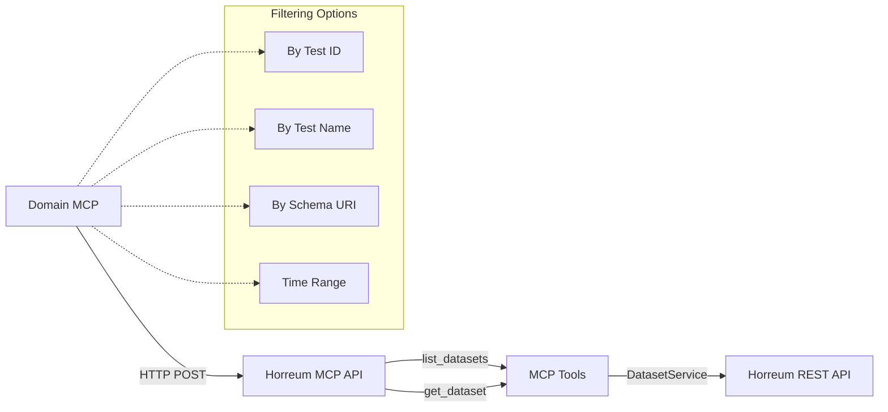

# Dataset Endpoints Implementation Summary

**Date:** 2025-09-30  
**Status:** ✅ Complete  
**Commit:** cfb5ab3

## Overview

Implemented two critical dataset endpoints required by RHIVOS PerfScale MCP
integration, completing the HTTP API for server-to-server communication.

## What Was Implemented

### 1. MCP Tools

#### `list_datasets` Tool

**Purpose:** Search and list datasets across tests and runs with flexible
filtering.

**Parameters:**

- `test_id` (number, optional) - Filter by test ID
- `test_name` (string, optional) - Filter by test name
- `schema_uri` (string, optional) - Filter by schema URI
- `from` (string, optional) - Start time (ISO timestamp or epoch millis)
- `to` (string, optional) - End time (ISO timestamp or epoch millis)
- `page_size` (number, optional, default: 100) - Max results per page
- `page` (number, optional, default: 0) - Page number
- `sort` (string, optional) - Sort field
- `direction` (enum, optional) - Sort direction (Ascending/Descending)

**Response Format:**

```json
{
  "datasets": [
    {
      "dataset_id": 12345,
      "run_id": 67890,
      "test_id": 262,
      "test_name": "boot-time-verbose",
      "start": "2025-09-29T10:00:00Z",
      "stop": "2025-09-29T10:05:00Z",
      "schema_uri": "urn:rhivos-boot-time:1.0",
      "schemas": ["urn:rhivos-boot-time:1.0"]
    }
  ],
  "pagination": {
    "has_more": true,
    "total_count": 520
  }
}
```

**Implementation Details:**

- Uses `DatasetService.datasetServiceListByTest()` for test-based filtering
- Uses `DatasetService.datasetServiceListDatasetsBySchema()` for schema-based
  filtering
- Requires at least one of: `test_id`, `test_name`, or `schema_uri`
- Supports optional time filtering (client-side) via `from`/`to` parameters
- Test name resolution via `TestService.testServiceGetByNameOrId()`

#### `get_dataset` Tool

**Purpose:** Retrieve the complete raw JSON content of a specific dataset.

**Parameters:**

- `dataset_id` (number, required) - The dataset ID to retrieve

**Response Format:**

```json
{
  "dataset_id": 12345,
  "run_id": 67890,
  "test_id": 262,
  "start": "2025-09-29T10:00:00Z",
  "stop": "2025-09-29T10:05:00Z",
  "description": "Boot time measurement",
  "content": {
    "$schema": "urn:rhivos-boot-time:1.0",
    "metadata": {},
    "measurements": []
  }
}
```

**Implementation Details:**

- Uses `DatasetService.datasetServiceGetDataset()` to fetch dataset by ID
- Returns complete dataset with metadata and raw JSON content
- Content field contains the full dataset data payload

### 2. HTTP POST Endpoints

Both MCP tools are exposed as HTTP POST endpoints for direct server-to-server
integration:

#### `POST /api/tools/horreum_list_datasets`

**Example Request:**

```bash
curl -X POST http://localhost:3001/api/tools/horreum_list_datasets \
  -H "Content-Type: application/json" \
  -H "Authorization: Bearer your-token" \
  -d '{
    "test_id": 262,
    "schema_uri": "urn:rhivos-boot-time:1.0",
    "from": "2025-09-23T00:00:00Z",
    "to": "2025-09-30T23:59:59Z",
    "page_size": 10
  }'
```

#### `POST /api/tools/horreum_get_dataset`

**Example Request:**

```bash
curl -X POST http://localhost:3001/api/tools/horreum_get_dataset \
  -H "Content-Type: application/json" \
  -H "Authorization: Bearer your-token" \
  -d '{"dataset_id": 12345}'
```

### 3. Error Handling

Both endpoints implement standardized Source MCP Contract error handling:

**Error Codes:**

- `INVALID_REQUEST` (400) - Missing required filters, invalid parameters
- `NOT_FOUND` (404) - Dataset or test not found
- `INVALID_REQUEST` (401/403) - Authentication failed
- `RATE_LIMITED` (429) - Rate limited by upstream Horreum API
- `SERVICE_UNAVAILABLE` (502/503) - Upstream service unavailable
- `TIMEOUT` (504) - Request timed out
- `INTERNAL_ERROR` (500) - Internal server error

**Error Response Format:**

```json
{
  "error": {
    "code": "INVALID_REQUEST",
    "message": "Please provide either test_id, test_name, or schema_uri",
    "retryable": false
  }
}
```

## Testing

### Smoke Test Suite

Created comprehensive smoke test: `scripts/smoke-http-datasets.mjs`

**8 Test Cases:**

1. ✅ List datasets by test_id
2. ✅ List datasets by test_name
3. ✅ List datasets by schema_uri
4. ✅ List datasets with time filter (from/to)
5. ✅ List datasets missing filter (expect 400)
6. ✅ Get specific dataset by ID
7. ✅ Get dataset with invalid ID (expect 400)
8. ✅ Get dataset with missing ID (expect 400)

**Run Tests:**

```bash
# Start Horreum MCP in HTTP mode
HTTP_MODE_ENABLED=true npm start

# In another terminal
node scripts/smoke-http-datasets.mjs http://localhost:3001 your-token
```

## Files Changed

### New Files

- `scripts/smoke-http-datasets.mjs` - Comprehensive smoke tests (192 lines)

### Modified Files

- `src/server/tools.ts` - Added list_datasets and get_dataset MCP tools
- `src/server/http.ts` - Added HTTP POST endpoints with error handling
- `README.md` - Updated HTTP API endpoint list
- `mcp_development_plan.md` - Updated Phase 6 status and changelog

## Integration Benefits

### For Domain MCP Servers

1. **Direct Dataset Access**: No need for separate Horreum API integration
2. **Flexible Filtering**: Search by test, schema, or time range
3. **Raw Data Retrieval**: Complete dataset content for analysis
4. **Standardized Errors**: Consistent error handling across all endpoints

### For AI Clients

Natural language queries now work for datasets:

- _"List datasets for test 262 from the last week"_
- _"Get the content of dataset 12345"_
- _"Show me all datasets using the boot-time schema"_

## Change Request Status

✅ **CR-20250930-4 (Schema URI Filtering)** - COMPLETED

Previously deferred as "datasets.search tool doesn't exist yet". Now fully
implemented via `list_datasets` tool with `schemaUri` parameter.

## Next Steps

All Phase 6 requirements are now complete:

- ✅ 7 HTTP POST endpoints (5 tools + 2 dataset + source.describe)
- ✅ Standardized error handling (CR-20250930-1)
- ✅ Pagination support (CR-20250930-3)
- ✅ Capability discovery (CR-20250930-2)
- ✅ Schema URI filtering (CR-20250930-4)
- ✅ Time range documentation (CR-20250930-5)
- ✅ SSL/TLS configuration

**Ready for:** Phase 7 (Enhanced CI/CD Pipeline)

## Usage Examples

### List Datasets by Test

```bash
curl -X POST http://localhost:3001/api/tools/horreum_list_datasets \
  -H "Content-Type: application/json" \
  -H "Authorization: Bearer token" \
  -d '{"test_id": 262, "page_size": 5}'
```

### List Datasets by Schema

```bash
curl -X POST http://localhost:3001/api/tools/horreum_list_datasets \
  -H "Content-Type: application/json" \
  -H "Authorization: Bearer token" \
  -d '{"schema_uri": "urn:rhivos-boot-time:1.0", "page_size": 10}'
```

### List Datasets with Time Filter

```bash
curl -X POST http://localhost:3001/api/tools/horreum_list_datasets \
  -H "Content-Type: application/json" \
  -H "Authorization: Bearer token" \
  -d '{
    "test_name": "boot-time-verbose",
    "from": "2025-09-23T00:00:00Z",
    "to": "2025-09-30T23:59:59Z",
    "page_size": 20
  }'
```

### Get Dataset Content

```bash
curl -X POST http://localhost:3001/api/tools/horreum_get_dataset \
  -H "Content-Type: application/json" \
  -H "Authorization: Bearer token" \
  -d '{"dataset_id": 12345}'
```

## Architecture



## References

- **Requirements:** User-provided requirements document
- **Source MCP Contract:** `docs/source_mcp_contract.md`
- **Development Plan:** `mcp_development_plan.md`
- **Integration Status:** `RHIVOS_INTEGRATION.md`
- **Time Filtering:** `docs/TIME_RANGE_FILTERING.md`
