# Horreum MCP Server

A Model Context Protocol (MCP) server that exposes
[Horreum](https://horreum.hyperfoil.io/) capabilities as tools and resources for
AI clients. This allows AI agents to interact with Horreum to manage tests,
schemas, runs, and more.

## Status

**Phase 4 Complete** - Ready for enterprise deployment enhancements:

- **✅ Core Functionality**: Read tools, write tools, observability, and HTTP mode
- **✅ Production Ready**: Structured logging, metrics, tracing, comprehensive testing
- **🚀 Next Phase**: Containerization & multi-architecture support (Phase 5)

### Completed Features

- MCP tools: `ping`, `list_tests`, `get_schema`, `list_runs`, `upload_run`
- Dual transport modes: stdio (default) and HTTP server
- External LLM integration (OpenAI, Anthropic, Azure)
- Comprehensive observability (Pino logging, Prometheus metrics, OpenTelemetry)
- Rate-limited fetch with retries/backoff
- Session management and security (CORS, Bearer auth)

### Upcoming Enhancements (Phases 5-11)

- **Phase 5**: Multi-architecture containerization with automated registry deployment
- **Phase 6**: Enhanced CI/CD pipeline with comprehensive security scanning
- **Phase 7**: Architecture refactoring for modularity and plugin system
- **Phase 8**: REST API endpoints alongside MCP protocol
- **Phases 9-11**: Build system enhancement, security hardening, data analysis

For detailed roadmap, see [mcp_development_plan.md](mcp_development_plan.md).

## Features

The server provides the following tools for AI clients:

- `ping`: A simple connectivity check.
- `list_tests`: Lists Horreum tests with support for pagination and filters.
- `get_schema`: Retrieves a schema by its ID or name.
- `list_runs`: Lists runs for a given test (by ID or name), with pagination,
  sorting, and optional time filters (`from`/`to`).
- `upload_run`: Uploads a run JSON payload to a specified test.

In addition to tools, the server exposes key resources as URIs:

- `horreum://tests/{id}`
- `horreum://schemas/{id}`
- `horreum://tests/{testId}/runs/{runId}`

## Architecture

### System Overview

```mermaid
graph TB
    subgraph "AI Client Environment"
        AI[AI Client<br/>Claude/Cursor/etc<br/>✅ IMPLEMENTED]
    end

    subgraph "MCP Server Modes"
        direction TB
        MCP[Horreum MCP Server<br/>✅ IMPLEMENTED]

        subgraph "Transport Options"
            STDIO[Stdio Transport<br/>✅ DEFAULT]
            HTTP[HTTP Transport<br/>✅ IMPLEMENTED]
        end

        MCP --> STDIO
        MCP --> HTTP
    end

    subgraph "External Services"
        direction TB
        HORREUM[Horreum Instance<br/>Performance Testing<br/>✅ INTEGRATED]
        LLM[LLM APIs<br/>OpenAI/Anthropic/Azure<br/>✅ IMPLEMENTED]
    end

    subgraph "Observability Stack"
        direction TB
        PROM[Prometheus Metrics<br/>✅ IMPLEMENTED]
        OTEL[OpenTelemetry Tracing<br/>✅ IMPLEMENTED]
        LOGS[Structured Logging<br/>✅ IMPLEMENTED]
    end

    AI -->|stdio/spawn| STDIO
    AI -->|HTTP requests| HTTP
    MCP -->|API calls| HORREUM
    HTTP -->|inference| LLM
    MCP --> PROM
    MCP --> OTEL
    MCP --> LOGS

    classDef implemented fill:#c8e6c9,stroke:#4caf50,stroke-width:2px,color:#000000
    classDef planned fill:#fff3e0,stroke:#ff9800,stroke-width:2px,stroke-dasharray: 5 5,color:#000000
    classDef external fill:#f3e5f5,stroke:#9c27b0,stroke-width:2px,color:#000000

    class AI,STDIO,MCP,HORREUM,PROM,OTEL,LOGS,HTTP,LLM implemented

    %% Future Enhancements (Phase 5+)
    subgraph "Enterprise Features 🚧"
        direction TB
        CONTAINER[Multi-Arch Containers<br/>🚧 PHASE 5]
        REST[REST API Endpoints<br/>🚧 PHASE 8]
        PLUGIN[Plugin Architecture<br/>🚧 PHASE 7]
    end

    MCP -.->|"Future"| CONTAINER
    HTTP -.->|"Future"| REST
    TOOLS -.->|"Future"| PLUGIN

    class CONTAINER,REST,PLUGIN planned

    %% Legend
    subgraph Legend[" "]
        L1[✅ Implemented - Phase 1-4 Complete]
        L2[🚧 Planned - Phase 5+ Roadmap]
        L3[🔗 External - Third-party Services]
    end

    class L1 implemented
    class L2 planned
    class L3 external
```



### Request Flow - Stdio Mode (✅ Implemented)

```mermaid
sequenceDiagram
    participant AI as AI Client<br/>✅ Working
    participant MCP as MCP Server<br/>✅ Phase 1-3 Complete
    participant H as Horreum API<br/>✅ Integrated
    participant OBS as Observability<br/>✅ Full Stack

    AI->>MCP: spawn process (stdio)
    MCP->>MCP: initialize transport
    MCP->>AI: capabilities & tools

    AI->>MCP: tool call (e.g., list_tests)
    MCP->>OBS: log start + correlation ID
    MCP->>OBS: start span
    MCP->>H: HTTP request (rate limited)
    H-->>MCP: response data
    MCP->>OBS: record metrics
    MCP->>OBS: end span
    MCP->>OBS: log completion
    MCP-->>AI: tool response

    Note over MCP,H: ✅ Retries & backoff implemented
    Note over MCP,OBS: ✅ Correlation IDs across all logs
    Note over AI,OBS: ✅ All components fully operational
```



### Request Flow - HTTP Mode (✅ Implemented)

```mermaid
sequenceDiagram
    participant CLIENT as HTTP Client<br/>✅ Ready
    participant MCP as MCP Server<br/>✅ HTTP Transport Ready
    participant LLM as LLM API<br/>✅ Integrated
    participant H as Horreum API<br/>✅ Integrated
    participant OBS as Observability<br/>✅ Full Stack

    CLIENT->>MCP: POST /mcp (initialize)
    MCP->>MCP: create session + UUID
    MCP->>OBS: log session start
    MCP-->>CLIENT: session ID + capabilities

    CLIENT->>MCP: POST /mcp (tool call + session ID)
    MCP->>OBS: log start + correlation ID
    MCP->>OBS: start span

    alt Tool requires LLM inference
        MCP->>LLM: API request (configurable provider)
        LLM-->>MCP: inference result
    end

    MCP->>H: HTTP request (rate limited)
    H-->>MCP: Horreum data
    MCP->>OBS: record metrics
    MCP->>OBS: end span
    MCP->>OBS: log completion
    MCP-->>CLIENT: JSON response or SSE stream

    Note over CLIENT,MCP: ✅ CORS, Bearer auth supported
    Note over MCP,LLM: ✅ Multi-provider support (OpenAI, Anthropic, Azure)
    Note over MCP,H: ✅ Same rate limiting & retry logic
    Note over MCP,OBS: ✅ Same observability stack
```



### Component Architecture

```mermaid
graph TB
    subgraph "MCP Server Core ✅"
        direction TB
        ENTRY[Entry Point<br/>index.ts<br/>✅ IMPLEMENTED]
        TOOLS[Tool Registry<br/>server/tools.ts<br/>✅ IMPLEMENTED]
        ENV[Environment Config<br/>config/env.ts<br/>✅ IMPLEMENTED]
    end

    subgraph "Transport Layer ✅"
        direction TB
        STDIO_T[StdioServerTransport<br/>✅ DEFAULT]
        HTTP_T[StreamableHTTPServerTransport<br/>+ Express.js<br/>✅ IMPLEMENTED]
    end

    subgraph "Horreum Integration ✅"
        direction TB
        CLIENT[Generated OpenAPI Client<br/>✅ IMPLEMENTED]
        FETCH[Rate-Limited Fetch<br/>+ Retries/Backoff<br/>✅ IMPLEMENTED]
    end

    subgraph "LLM Integration ✅"
        direction TB
        LLM_CLIENT[Configurable LLM Client<br/>✅ IMPLEMENTED]
        PROVIDERS[OpenAI / Anthropic / Azure<br/>✅ IMPLEMENTED]
    end

    subgraph "Observability ✅"
        direction TB
        METRICS[Prometheus Metrics<br/>metrics.ts<br/>✅ IMPLEMENTED]
        TRACING[OpenTelemetry<br/>tracing.ts<br/>✅ IMPLEMENTED]
        LOGGING[Pino Structured Logs<br/>✅ IMPLEMENTED]
    end

    ENTRY --> ENV
    ENTRY --> TOOLS
    ENTRY --> STDIO_T
    ENTRY --> HTTP_T
    TOOLS --> CLIENT
    CLIENT --> FETCH
    HTTP_T --> LLM_CLIENT
    LLM_CLIENT --> PROVIDERS
    TOOLS --> METRICS
    TOOLS --> TRACING
    TOOLS --> LOGGING

    classDef implemented fill:#c8e6c9,stroke:#4caf50,stroke-width:2px,color:#000000
    classDef planned fill:#fff3e0,stroke:#ff9800,stroke-width:2px,stroke-dasharray: 5 5,color:#000000

    class ENTRY,TOOLS,ENV,STDIO_T,CLIENT,FETCH,METRICS,TRACING,LOGGING,HTTP_T,LLM_CLIENT,PROVIDERS implemented

    %% Implementation Status
    subgraph Status[" "]
        S1[✅ Implemented & Tested]
        S2[🚧 Phase 5+ Development]
    end

    class S1 implemented
    class S2 planned
```



## Prerequisites

Before you begin, ensure you have the following installed:

- [Node.js](https://nodejs.org/) (v20 or higher)
- [npm](https://www.npmjs.com/)

## Installation

To get started, clone the repository and install the dependencies:

```bash
git clone https://github.com/your-username/horreum-mcp.git
cd horreum-mcp
npm ci
```

Next, build the project.

> [!IMPORTANT]
> This build step is required before the server can be run, either manually or by an AI client.

```bash
npm run build
```

## Configuration

The server is configured using environment variables. For local development and
manual runs, you can create a `.env` file in the root of the project.

```bash
# .env
HORREUM_BASE_URL=https://horreum.example.com
# HORREUM_TOKEN=your-horreum-api-token
HORREUM_RATE_LIMIT=10
HORREUM_TIMEOUT=30000
HORREUM_API_VERSION=latest
```

| Variable              | Description                                                         |
| --------------------- | ------------------------------------------------------------------- |
| `HORREUM_BASE_URL`    | The base URL of your Horreum instance.                              |
| `HORREUM_TOKEN`       | Your Horreum API token. Required for writes and private resource    |
|                       | access.                                                             |
| `HORREUM_RATE_LIMIT`  | Client-side rate limit in requests per second.                      |
| `HORREUM_TIMEOUT`     | Per-request timeout in milliseconds.                                |
| `HORREUM_API_VERSION` | The version of the Horreum API to use.                              |
| `LOG_LEVEL`           | Logging level for pino (`info`, `debug`, `error`). Default: `info`. |
| `METRICS_ENABLED`     | Enable Prometheus metrics endpoint. Default: `false`.               |
| `METRICS_PORT`        | Port for metrics endpoint. Default: `9464`.                         |
| `METRICS_PATH`        | Path for metrics endpoint. Default: `/metrics`.                     |

> [!NOTE]
> When using an AI client, these environment variables are typically set in the
> client's configuration, and a local `.env` file is not required.

## Usage

The server supports multiple deployment modes:

- **Stdio Mode** (default): Local integration with MCP-native AI clients
- **HTTP Mode**: Persistent server for network access and web API integration
- **Container Mode** (Phase 5): Multi-architecture containerized deployment 🚧

### Container Usage (Phase 5)

Build a multi-arch image using Buildah (inspired by rhivos-perfscale-mcp):

```bash
# Build amd64+arm64 and push to registry
export IMAGE_REPO=quay.io/<org>/horreum-mcp
export REGISTRY_USERNAME=... REGISTRY_PASSWORD=...
bash scripts/build_multiarch.sh --tag main --push --push-main

# Or build locally without pushing
bash scripts/build_multiarch.sh --tag local
```

Run the container with HTTP mode enabled:

```bash
podman run --rm -p 3000:3000 \
  -e HORREUM_BASE_URL=https://horreum.example.com \
  -e HTTP_MODE_ENABLED=true \
  -e HTTP_AUTH_TOKEN=changeme \
  quay.io/<org>/horreum-mcp:main

# Health endpoints
curl http://localhost:3000/health
curl -H 'Authorization: Bearer changeme' http://localhost:3000/ready
```

> [!NOTE]
> Container deployment with multi-architecture support (amd64/arm64) and automated
> registry deployment is planned for Phase 5. This will enable enterprise deployment
> scenarios including Kubernetes, cloud hosting, and CI/CD integration.

### Usage with AI Clients

Most MCP-enabled AI clients support connecting to a server via either spawning a
local process (`stdio`) or connecting to a URL (`HTTP`).

#### Stdio Mode (Spawning a Local Process)

In this mode, the client starts the MCP server as a child process and
communicates with it over standard input/output.

- **Pros:** Simple setup for local development; no networking required.
- **Cons:** The server only runs when the client is active.

The core configuration is the same for all clients:

- **Command:** `node`
- **Args:** `/absolute/path/to/horreum-mcp/build/index.js`
- **Environment:**
  - `HORREUM_BASE_URL=https://horreum.example.com`
  - `HORREUM_TOKEN=${HORREUM_TOKEN}` (if required)

> [!WARNING]
> Always use an absolute path for the `args` value. Many clients do not expand
> `~` or resolve relative paths correctly.

#### HTTP Mode (Connecting to a URL)

In this mode, you run the MCP server as a persistent process, and the client
connects to it via an HTTP endpoint.

1.  **Configure `.env` for HTTP mode:**

    ```bash
    # .env
    HORREUM_BASE_URL=https://horreum.example.com
    HTTP_MODE_ENABLED=true
    HTTP_PORT=3000
    HTTP_AUTH_TOKEN=my-secret-token # Optional but recommended
    ```

2.  **Start the server:**

    ```bash
    npm start
    ```

- **Pros:** The server can run continuously, be shared by multiple clients, and
  be deployed remotely.
- **Cons:** Requires managing a running process and network configuration.

---

Below are examples of how to configure popular AI clients for both modes.

<details>
<summary>Gemini CLI</summary>

Add the server configuration to your Gemini settings file (typically
`~/.gemini/settings.json`).

**Stdio Mode:**

```json
{
  "mcpServers": {
    "horreum-local": {
      "command": "node",
      "args": ["/absolute/path/to/horreum-mcp/build/index.js"],
      "env": {
        "HORREUM_BASE_URL": "https://horreum.example.com",
        "HORREUM_TOKEN": "${HORREUM_TOKEN}"
      }
    }
  }
}
```

**HTTP Mode:**

```json
{
  "mcpServers": {
    "horreum-remote": {
      "url": "http://localhost:3000/mcp",
      "headers": {
        "Authorization": "Bearer my-secret-token"
      },
      "description": "A server to query Horreum for performance data."
    }
  }
}
```

</details>

<details>
<summary>Claude (VS Code & Desktop)</summary>

- **Claude Code (VS Code/JetBrains):** Add the server configuration to your
  `claude_mcp.json` file.
- **Claude Desktop:** Add the server via **Preferences → MCP**.

**Stdio Mode:**

```json
{
  "mcpServers": {
    "horreum-local": {
      "command": "node",
      "args": ["/absolute/path/to/horreum-mcp/build/index.js"],
      "env": {
        "HORREUM_BASE_URL": "https://horreum.example.com",
        "HORREUM_TOKEN": "${HORREUM_TOKEN}"
      }
    }
  }
}
```

**HTTP Mode:**

```json
{
  "mcpServers": {
    "horreum-remote": {
      "url": "http://localhost:3000/mcp",
      "headers": {
        "Authorization": "Bearer my-secret-token"
      }
    }
  }
}
```

</details>

<details>
<summary>Cursor</summary>

Open **Settings → MCP → Add Server**. The `stdio` mode is confirmed to work. HTTP
configuration via the UI is not documented at this time.

**Stdio Mode:**

- **Command:** `node`
- **Args:** `/absolute/path/to/horreum-mcp/build/index.js`
- **Env:** `HORREUM_BASE_URL`, `HORREUM_TOKEN` (if needed)

</details>

<br>

### Manual (Local) Testing

For local testing, you can start the server and use the provided smoke tests to
validate its functionality.

1.  **Start the server:**

    ```bash
    npm start
    ```

    This will run the compiled server from `./build/index.js`.

2.  **Enable Prometheus metrics (optional):**

    Set environment variables and scrape from Prometheus:

    ```bash
    export METRICS_ENABLED=true
    export METRICS_PORT=9464
    export METRICS_PATH=/metrics
    npm start
    # Scrape http://localhost:9464/metrics
    ```

3.  **Enable OpenTelemetry tracing (optional):**

    OpenTelemetry tracing can be enabled to export spans (including HTTP calls via undici):

    ```bash
    export TRACING_ENABLED=true
    # Configure OTLP endpoint via standard envs, e.g. OTEL_EXPORTER_OTLP_ENDPOINT
    npm start
    ```

    Spans include per-tool and per-resource operations and all outbound fetch calls.

4.  **Run smoke tests:**

    The smoke tests provide a quick way to validate the server's tools from the
    command line.
    - `npm run smoke`: Pings the server.
    - `npm run smoke:tests`: Lists tests.
    - `npm run smoke:schema`: Gets a schema.
    - `npm run smoke:runs`: Lists runs.
    - `npm run smoke:upload`: Mocks an upload.

<br>

## Sample Prompts

Below are some examples of natural language prompts you can use with your AI
client.

- **"List all available tests."**

  > **Expected behavior:** The AI client will use the `list_tests` tool to
  > retrieve a list of all tests you have access to.

- **"Get the schema with the name `my-schema-name`."**

  > **Expected behavior:** The AI client will use the `get_schema` tool to
  > retrieve the schema with the specified name.

- **"Show me the latest 5 runs for test ID 123."**

  > **Expected behavior:** The AI client will use the `list_runs` tool with a
  > limit of 5 to retrieve the most recent runs for the specified test.

- **"Upload a new run to the `my-test` test."**

  > **Expected behavior:** The AI client will use the `upload_run` tool. It may
  > ask for the required data, such as the start and stop times and the JSON
  > payload for the run.

## Development

This section provides information for developers contributing to the project.

### Code Quality & Standards

**Current Implementation:**

- TypeScript with strict type checking
- ESLint + Prettier for code formatting
- Pre-commit hooks with secret detection and vulnerability scanning
- Comprehensive smoke tests with mocked responses

**Enhanced Practices (Phase 6):** 🚧

- Multi-tool security scanning (osv-scanner, SAST)
- Code coverage requirements with trend analysis
- Performance benchmarking and regression detection
- Automated dependency updates with testing

### Commands

- **Type checking and linting:** `npm run check`
- **Formatting:** `npm run format`
- **Testing:** `npm test` (Vitest with coverage)
- **Security scanning:** `npm run lint:secrets`
- **Build:** `npm run build`

### Git Hooks

Pre-commit hooks ensure code quality and security:

- Secret detection (`secretlint`)
- Dependency vulnerability scanning (`npm audit`)
- Code formatting validation
- TypeScript type checking

```bash
git config core.hooksPath .githooks
```

### Generating the Horreum OpenAPI Client

The Horreum API client is generated from an OpenAPI specification. To regenerate
the client:

```bash
npm run gen:api -- --input https://your-horreum.example.com/q/openapi?format=json
```

The generated code will be placed in `src/horreum/generated/`.

## License

This project is licensed under the Apache 2.0 License. See the [LICENSE](LICENSE)
file for details.
