# Horreum MCP Server

A Model Context Protocol (MCP) server that connects AI assistants to 
[Horreum](https://horreum.hyperfoil.io/) performance testing databases. This 
enables AI agents to query performance data, analyze test results, and manage 
testing workflows through natural language.

**What this does:**
- 🔍 **Query performance data** from Horreum instances
- 📊 **Analyze test results** with built-in tools and filters  
- 🤖 **Works with AI assistants** through the Model Context Protocol (MCP)
- 🚀 **Upload test runs** and manage testing workflows
- 📈 **Access schemas** and test configurations

## Quick Start

Choose your preferred way to get started:

### 🐳 **Use Pre-built Container (Recommended)**
```bash
# Run the server with HTTP mode enabled
podman run --rm -p 127.0.0.1:3000:3000 \
  -e HORREUM_BASE_URL=https://horreum.example.com \
  -e HTTP_MODE_ENABLED=true \
  -e HTTP_AUTH_TOKEN=changeme \
  quay.io/redhat-performance/horreum-mcp:main

# Test it works
curl -H 'Authorization: Bearer changeme' http://localhost:3000/health
```

### 🔧 **Development Setup**

**Prerequisites:** Node.js v20+, npm

```bash
# 1. Clone and setup
git clone https://github.com/dustinblack/horreum-mcp.git
cd horreum-mcp
npm ci
npm run build

# 2. Configure environment
cp .env.example .env
# Edit .env with your Horreum instance details

# 3. Run the server
npm start -- --log-level info
```

## Status

**Phase 5 Complete** - Production ready with full observability:

- ✅ **Core Tools**: `ping`, `list_tests`, `get_schema`, `list_runs`, `upload_run`
- ✅ **Dual Transport**: stdio (default) and HTTP server modes
- ✅ **Production Ready**: Structured logging, metrics, tracing, security
- 🚀 **Next Phase**: Enhanced CI/CD and security scanning

## Features

### Core Tools
- **`ping`**: Simple connectivity check and health monitoring
- **`list_tests`**: Browse tests with pagination and filtering support
- **`get_schema`**: Retrieve schema definitions by ID or name
- **`list_runs`**: Query test runs with sorting and time-based filtering
- **`upload_run`**: Submit new test run data to Horreum

### Transport Modes
- **Stdio Mode** (default): Direct integration with MCP-compatible AI clients
- **HTTP Mode**: Persistent server for network access and web API integration
- **Container Mode**: Multi-architecture containerized deployment

### Production Features
- **Observability**: Structured logging (Pino), Prometheus metrics, OpenTelemetry tracing
- **Security**: Bearer token authentication, CORS support, rate limiting
- **Reliability**: Automatic retries with exponential backoff, session management

## Architecture

The Horreum MCP Server acts as a bridge between AI clients and Horreum 
performance testing instances:

```mermaid
flowchart LR
    Client[🤖 AI Client<br/>Claude, Cursor, etc.]
    MCP[📊 Horreum MCP Server<br/>this project]
    Horreum[🗄️ Horreum Instance<br/>performance database]
    
    Client <--> MCP
    MCP <--> Horreum
    
    style MCP fill:#e1f5fe,stroke:#333,stroke-width:2px,color:#000
    style Client fill:#f3e5f5,stroke:#333,stroke-width:2px,color:#000
    style Horreum fill:#e8f5e8,stroke:#333,stroke-width:2px,color:#000
```



### Key Components
- **Transport Layer**: Supports both stdio (default) and HTTP server modes
- **Horreum Integration**: Generated OpenAPI client with rate limiting and retries
- **Observability**: Comprehensive logging, metrics, and tracing
- **Security**: Bearer token authentication, CORS, and session management

## Configuration

The server is configured using environment variables. Create a `.env` file for 
local development:

```bash
# Required - Your Horreum instance
HORREUM_BASE_URL=https://horreum.example.com
HORREUM_TOKEN=your-api-token

# Optional - Performance tuning
HORREUM_RATE_LIMIT=10
HORREUM_TIMEOUT=30000

# Optional - HTTP mode (for persistent server)
HTTP_MODE_ENABLED=false
HTTP_PORT=3000
HTTP_AUTH_TOKEN=changeme

# Optional - Observability
LOG_LEVEL=info
METRICS_ENABLED=false
TRACING_ENABLED=false
```

### Key Configuration Options

| Variable | Required | Description |
|----------|----------|-------------|
| `HORREUM_BASE_URL` | ✅ | Base URL of your Horreum instance |
| `HORREUM_TOKEN` | ⚠️ | API token (required for writes/private data) |
| `HTTP_MODE_ENABLED` | ❌ | Enable HTTP server mode (default: stdio) |
| `HTTP_AUTH_TOKEN` | ❌ | Secure your HTTP endpoints |
| `LOG_LEVEL` | ❌ | Logging verbosity (`info`, `debug`, `trace`) |

> [!NOTE]
> When using with AI clients, these variables are typically configured in the client's MCP server settings rather than a local `.env` file.

## Usage

### With AI Assistants (Recommended)

The primary use case is connecting AI assistants to Horreum for natural language 
performance analysis.

**Supported AI Clients:**
- Claude Desktop/Code
- Cursor
- Any MCP-compatible client

**Setup Steps:**
1. Build the project: `npm ci && npm run build`
2. Configure your AI client with the server details (see examples below)
3. Start asking questions like: *"List all tests in Horreum"* or *"Show me the 
   latest runs for test 123"*

### Container Deployment

For production or shared environments:

```bash
# Run with HTTP mode for network access
podman run --rm -p 127.0.0.1:3000:3000 \
  -e HORREUM_BASE_URL=https://horreum.example.com \
  -e HTTP_MODE_ENABLED=true \
  -e HTTP_AUTH_TOKEN=changeme \
  quay.io/redhat-performance/horreum-mcp:main

# Test the deployment
curl -H 'Authorization: Bearer changeme' \
     http://localhost:3000/health
```

### Local Development

For testing and development:

```bash
# Start in stdio mode (for AI client testing)
npm start -- --log-level debug

# Or start in HTTP mode (for API testing)
HTTP_MODE_ENABLED=true npm start
```

## AI Client Configuration

### Stdio Mode (Recommended)

Configure your AI client to spawn the MCP server as a local process:

**Core Settings (all clients):**
- **Command:** `node`
- **Args:** `/absolute/path/to/horreum-mcp/build/index.js`
- **Environment:** `HORREUM_BASE_URL=https://horreum.example.com`

> [!IMPORTANT]
> Use absolute paths - many clients don't resolve `~` or relative paths 
> correctly.

**Claude Desktop/Code** (`claude_mcp.json` or Preferences → MCP):
```json
{
  "mcpServers": {
    "horreum": {
      "command": "node",
      "args": ["/absolute/path/to/horreum-mcp/build/index.js"],
      "env": {
        "HORREUM_BASE_URL": "https://horreum.example.com",
        "HORREUM_TOKEN": "${HORREUM_TOKEN}"
      }
    }
  }
}
```

**Cursor** (Settings → MCP → Add Server):
- Command: `node`
- Args: `/absolute/path/to/horreum-mcp/build/index.js`
- Env: `HORREUM_BASE_URL`, `HORREUM_TOKEN`

### HTTP Mode (Advanced)

For persistent servers or remote access:

1. Start the server: `HTTP_MODE_ENABLED=true npm start`
2. Configure client to connect to `http://localhost:3000/mcp`
3. Add `Authorization: Bearer changeme` header if auth is enabled

## What You Can Do

Once connected to an AI assistant, you can use natural language to interact 
with Horreum:

### Query Performance Data
- *"List all available tests in Horreum"*
- *"Show me the latest 10 runs for the boot-time test"*
- *"Get details for test run ID 12345"*
- *"Find tests created in the last month"*

### Analyze Results
- *"Compare the performance of the last 5 runs"*
- *"Show me any failed runs from yesterday"*
- *"What's the average runtime for test 'api-performance'?"*

### Manage Schemas and Data
- *"Get the schema definition for 'boot-metrics'"*
- *"Upload this test run data to the performance-test"*
- *"Show me all schemas containing 'memory' fields"*

### Testing and Validation

Run the included smoke tests to verify everything works:

```bash
# Quick validation
npm run smoke        # Test connectivity
npm run smoke:tests  # List available tests
npm run smoke:runs   # Query test runs

# Enable debug logging for troubleshooting
npm start -- --log-level debug
```

## Development

### Quick Start for Contributors

```bash
# Setup development environment
git clone https://github.com/dustinblack/horreum-mcp.git
cd horreum-mcp
npm ci
npm run build

# Run tests and validation
npm run check     # Type checking and linting
npm test         # Run test suite with coverage
npm run format   # Auto-format code

# Regenerate API client (if needed)
npm run gen:api -- --input https://horreum.example.com/q/openapi?format=json
```

### Code Quality Standards

- **TypeScript** with strict type checking
- **ESLint + Prettier** for consistent formatting
- **Pre-commit hooks** for security and quality checks
- **Comprehensive testing** with Vitest and smoke tests

### Project Roadmap

See [mcp_development_plan.md](mcp_development_plan.md) for detailed development 
phases and upcoming features.

## Contributing

We welcome contributions! All commits should include the tag 
"AI-assisted-by: <AI agent model(s)>" when AI agents were used for development 
work.

## License

This project is licensed under the Apache 2.0 License. See the 
[LICENSE](LICENSE) file for details.
