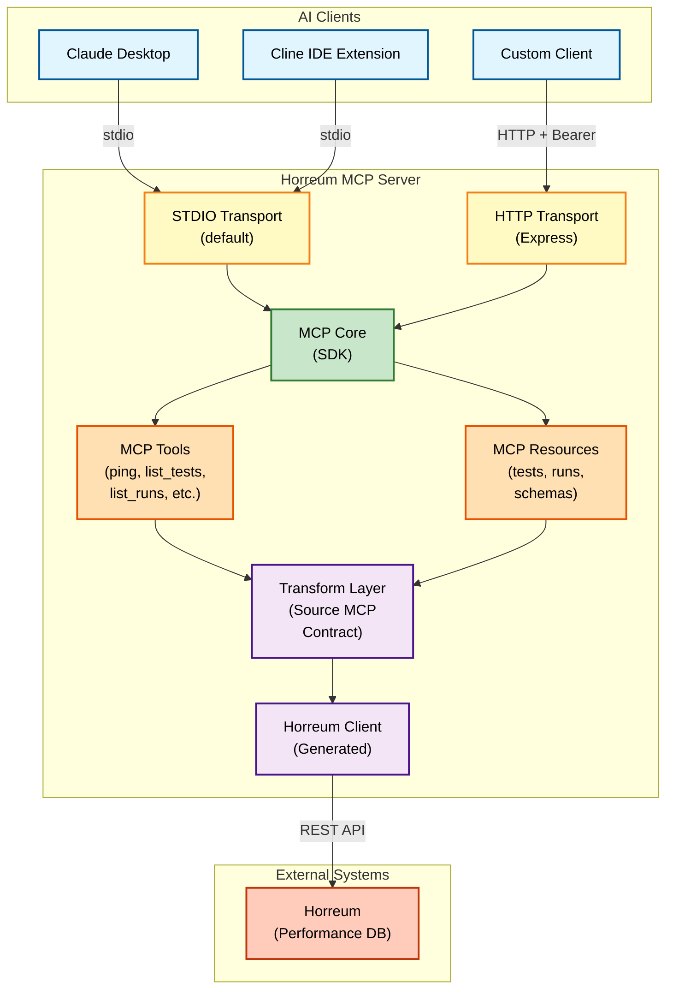

# Architecture Documentation

Technical architecture and design documentation for Horreum MCP.

## System Architecture

Horreum MCP is a Model Context Protocol server that provides AI assistants with
access to Horreum performance testing data.

### Key Components

- **MCP Core**: Model Context Protocol SDK implementation
- **Transport Layers**: Support both stdio (default) and HTTP modes
- **Tools & Resources**: Exposed capabilities for AI agents
- **Transform Layer**: Converts Horreum responses to Source MCP Contract format
- **Horreum Client**: Generated TypeScript client from OpenAPI spec

### Transport Modes

1. **stdio** - Default mode for local AI assistants (Claude Desktop, Cline)
2. **HTTP** - Server mode for remote clients and server-to-server integration

## Primary Purpose

**Horreum MCP is a Source MCP adapter** designed to provide standardized data
access for Domain-specific MCP servers. See the [Domain MCP Integration
Guide](domain-mcp-integration.md) to understand how to build Domain MCPs that
use Horreum MCP as a data source.

## Documents

- **[Domain MCP Integration Guide](domain-mcp-integration.md)** - **START
  HERE** - Complete guide to building Domain MCPs
- **[Source MCP Contract](source-mcp-contract.md)** - Contract specification
  and compliance

## Related Documentation

- [User Guide](../user-guide/README.md) - Features and usage (standalone mode)
- [CI/CD Workflow](../developer/ci-workflow.md) - Build and deployment pipeline
- [Deployment Guide](../deployment/README.md) - Deployment architectures
