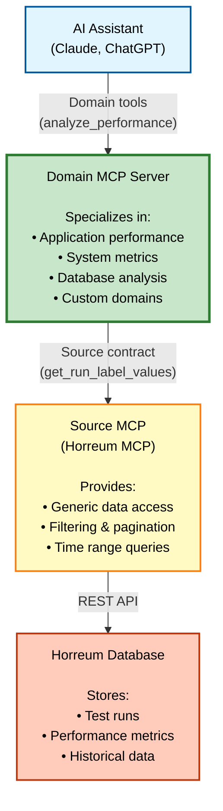
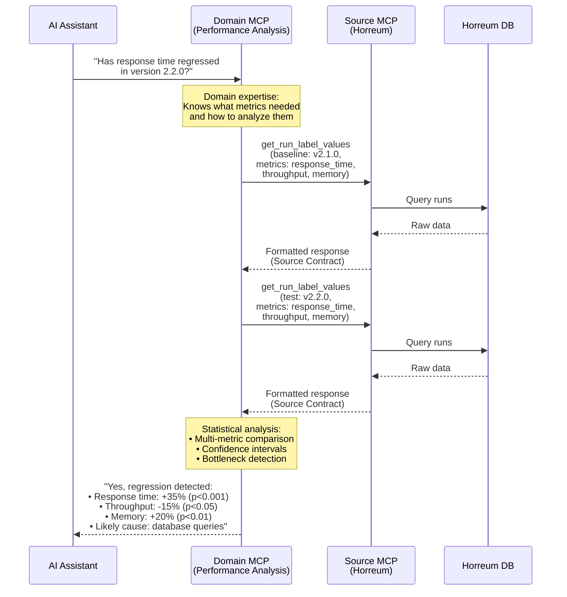
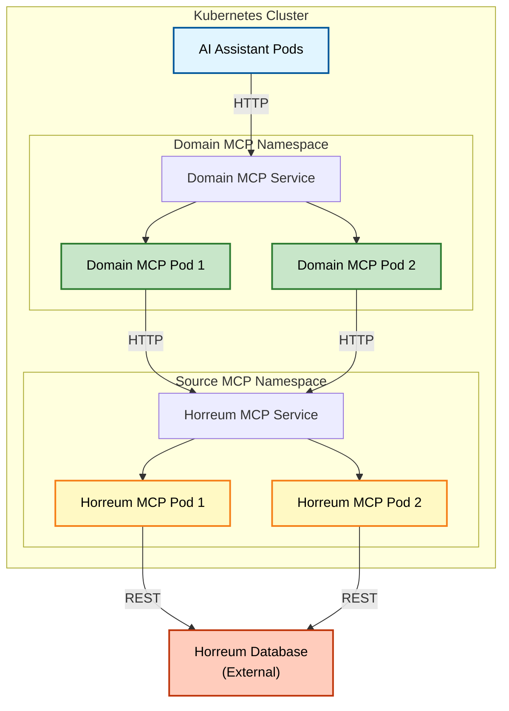

# Domain MCP Integration Guide

## Overview

While Horreum MCP can be used standalone, **its primary purpose is to serve as
a Source MCP adapter for Domain-specific MCP servers**. This architecture
enables domain experts to build specialized AI assistants without needing deep
knowledge of Horreum's API.

## Architecture Pattern

### The Problem

Horreum's API is powerful but complex:

- Generic data model (tests, runs, datasets, schemas, labels)
- Requires understanding of transformers and extractors
- Low-level operations (pagination, filtering, time ranges)
- No domain-specific context or analysis

### The Solution: Domain MCP Layer

Domain MCP servers sit between AI assistants and Source MCPs (like Horreum
MCP), providing:

- **Domain-specific tools** tailored to specific use cases
- **Intelligent analysis** of performance data
- **Context-aware responses** using domain expertise
- **Simplified interface** hiding complexity



## Source MCP Contract

The **Source MCP Contract** defines a standard interface that:

1. Domain MCPs can depend on (consistent API)
2. Source MCPs must implement (Horreum, Prometheus, etc.)
3. Enables swapping data sources without changing Domain MCP code

See [Source MCP Contract Reference](source-mcp-contract.md) for complete
specification.

### Key Contract Features

- **Standardized Data Format**: snake_case fields, string IDs, ISO timestamps
- **Consistent Errors**: Structured error responses with retry guidance
- **Pagination**: Uniform pagination with `has_more` and `total_count`
- **Capability Discovery**: Runtime introspection via `source.describe`

## Building a Domain MCP Server

### When to Build a Domain MCP

Create a Domain MCP when you need:

- **Domain expertise**: Specialized knowledge (e.g., Java GC optimization, database
  query performance)
- **Custom analysis**: Statistical analysis, trend detection, regression finding,
  capacity planning
- **Simplified interface**: Hide Horreum complexity from end users
- **Multi-source data**: Combine Horreum with other sources (Prometheus, application
  logs, traces)
- **Business context**: Add cost analysis, SLA compliance, business impact assessment

### Domain MCP Development Process

#### 1. Define Your Domain

Identify what makes your domain unique:

```typescript
// Example: System Performance Analysis Domain
const domain = {
  name: 'system-performance',
  metrics: ['cpu_usage_percent', 'memory_used_mb', 'disk_io_mbps', 'response_time_ms'],
  analyses: ['detect_regressions', 'compare_versions', 'identify_bottlenecks'],
  thresholds: {
    cpu_usage_percent: { warning: 75, critical: 90 },
    response_time_ms: { warning: 500, critical: 1000 },
  },
};
```

#### 2. Design Domain-Specific Tools

Create tools that provide value to your domain:

```typescript
// BAD: Just wrapping Source MCP (no value added)
{
  name: 'get_performance_data',
  description: 'Get performance data from Horreum',
}

// GOOD: Providing domain analysis
{
  name: 'analyze_performance_regression',
  description: 'Analyze performance trends and detect regressions across metrics',
  parameters: {
    baseline_version: 'v2.1.0',
    test_version: 'v2.2.0',
    metrics: ['response_time_ms', 'throughput_rps', 'memory_used_mb'],
    confidence_threshold: 0.95,
  },
}
```

#### 3. Implement Using Source Contract

Use the Source MCP Contract to fetch data:

```typescript
// Domain MCP implementation
async function analyzePerformanceRegression(params) {
  // 1. Fetch data from Source MCP for each metric
  const results = {};

  for (const metric of params.metrics) {
    const baselineData = await sourceMcp.getRunLabelValues({
      test_name: 'application-performance-test',
      filter: { version: params.baseline_version },
      include: [metric],
    });

    const testData = await sourceMcp.getRunLabelValues({
      test_name: 'application-performance-test',
      filter: { version: params.test_version },
      include: [metric],
    });

    // 2. Apply domain expertise (statistical analysis)
    const analysis = performStatisticalAnalysis(baselineData, testData);

    results[metric] = {
      regression_detected: analysis.pValue < params.confidence_threshold,
      baseline_mean: analysis.baselineMean,
      test_mean: analysis.testMean,
      percent_change: analysis.percentChange,
      confidence: analysis.confidence,
    };
  }

  // 3. Return actionable insights
  return {
    summary: generateSummary(results),
    metrics: results,
    recommendation: generateRecommendation(results),
    severity: calculateSeverity(results),
  };
}
```

#### 4. Set Up MCP Server

Create your MCP server following the MCP SDK patterns:

```typescript
import { Server } from '@modelcontextprotocol/sdk/server/index.js';
import { StdioServerTransport } from '@modelcontextprotocol/sdk/server/stdio.js';

const server = new Server(
  {
    name: 'performance-analysis-mcp',
    version: '1.0.0',
  },
  {
    capabilities: {
      tools: {},
    },
  }
);

// Register your domain tools
server.setRequestHandler(ListToolsRequestSchema, async () => ({
  tools: [
    {
      name: 'analyze_performance_regression',
      description: 'Detect performance regressions across multiple metrics',
      inputSchema: {
        /* ... */
      },
    },
    {
      name: 'compare_application_versions',
      description: 'Compare application performance between versions',
      inputSchema: {
        /* ... */
      },
    },
  ],
}));

server.setRequestHandler(CallToolRequestSchema, async (request) => {
  // Implement tool handlers
});

// Connect to Source MCP
const sourceMcp = connectToSourceMcp({
  url: process.env.SOURCE_MCP_URL,
  auth: process.env.SOURCE_MCP_TOKEN,
});
```

#### 5. Configure Source Connection

Domain MCPs connect to Source MCPs via HTTP:

```bash
# Domain MCP .env
SOURCE_MCP_URL=http://horreum-mcp:3000
SOURCE_MCP_TOKEN=your-token-here
DOMAIN_EXPERTISE_ENABLED=true
```

### Example: Performance Analysis Flow



## Best Practices

### 1. Keep Domain Logic in Domain MCP

**Don't** put domain logic in Source MCP:

```typescript
// ❌ Bad: Domain logic in Source MCP
sourceMcp.analyzeBootRegression(); // Too specific!
```

**Do** keep Source MCP generic:

```typescript
// ✅ Good: Generic data access
sourceMcp.getRunLabelValues({ filter: {...} });
```

### 2. Use Source Contract for Data Access

Always use the Source MCP Contract interface:

```typescript
// ✅ Good: Using standard contract
await sourceMcp.getRunLabelValues({
  test_id: '123',
  include: ['boot_time_ms'],
});

// ❌ Bad: Direct Horreum API calls
await fetch('https://horreum.../api/run/123/labelValues');
```

### 3. Handle Multiple Sources

Design to support multiple data sources:

```typescript
// Good: Abstracted data access
const bootData = await fetchBootData(params);

async function fetchBootData(params) {
  switch (params.source) {
    case 'horreum':
      return horreumMcp.getRunLabelValues(/*...*/);
    case 'prometheus':
      return prometheusMcp.queryRange(/*...*/);
    default:
      throw new Error(`Unknown source: ${params.source}`);
  }
}
```

### 4. Provide Clear Error Messages

Domain errors should be user-friendly:

```typescript
// ❌ Bad: Technical error
throw new Error('Label value transformation failed');

// ✅ Good: User-friendly error
throw new Error(
  'Could not find boot time data for OS version 6.2.0. ' +
    'Please check that this version has been tested.'
);
```

### 5. Document Your Domain Model

Create clear documentation of your domain:

```markdown
## Performance Analysis Domain

### System Performance Metrics

- `cpu_usage_percent`: CPU utilization percentage
- `memory_used_mb`: Memory consumption in megabytes
- `disk_io_mbps`: Disk I/O throughput
- `network_bandwidth_mbps`: Network utilization

### Application Performance Metrics

- `response_time_ms`: API/request response time
- `throughput_rps`: Requests per second
- `error_rate_percent`: Error percentage
- `gc_pause_time_ms`: Garbage collection pause time (Java/JVM)

### Analysis Methods

- **Regression Detection**: Statistical comparison between versions
- **Trend Analysis**: Time-series performance trending
- **Bottleneck Identification**: Identifies performance bottlenecks
- **Capacity Planning**: Predicts resource needs

### Thresholds

- Response Time: Normal < 500ms, Warning 500-1000ms, Critical > 1000ms
- CPU Usage: Normal < 75%, Warning 75-90%, Critical > 90%
- Error Rate: Normal < 1%, Warning 1-5%, Critical > 5%
```

## Deployment Architecture

### Typical Production Setup



### Configuration Example

**Source MCP (Horreum MCP)**:

```yaml
env:
  - name: HORREUM_BASE_URL
    value: 'https://horreum.example.com'
  - name: HTTP_MODE_ENABLED
    value: 'true'
  - name: HTTP_PORT
    value: '3000'
  - name: HTTP_AUTH_TOKEN
    valueFrom:
      secretKeyRef:
        name: source-mcp-secrets
        key: auth-token
```

**Domain MCP**:

```yaml
env:
  - name: SOURCE_MCP_URL
    value: 'http://horreum-mcp.source-mcp:3000'
  - name: SOURCE_MCP_TOKEN
    valueFrom:
      secretKeyRef:
        name: domain-mcp-secrets
        key: source-token
  - name: HTTP_MODE_ENABLED
    value: 'true'
```

## Getting Started

### 1. Set Up Horreum MCP

Follow the [deployment guide](../deployment/README.md) to deploy Horreum MCP.

### 2. Design Your Domain

- Identify your domain expertise
- Define key metrics and analyses
- Design user-facing tools

### 3. Implement Domain MCP

- Use [@modelcontextprotocol/sdk](https://github.com/modelcontextprotocol/sdk)
- Implement domain-specific tools
- Connect to Horreum MCP via Source Contract

### 4. Test Integration

```bash
# Test Source MCP
curl -H "Authorization: Bearer TOKEN" \\
  http://horreum-mcp:3000/health

# Test Domain MCP with Source connection
curl -H "Authorization: Bearer TOKEN" \\
  -X POST http://domain-mcp:8080/api/tools/analyze_performance_regression \\
  -d '{"baseline_version": "v2.1.0", "test_version": "v2.2.0", "metrics": ["response_time_ms", "throughput_rps"]}'
```

### 5. Connect AI Assistant

Configure your AI assistant to use the Domain MCP:

```json
{
  "mcpServers": {
    "performance-analysis": {
      "command": "npx",
      "args": ["-y", "performance-analysis-mcp"],
      "env": {
        "SOURCE_MCP_URL": "http://horreum-mcp:3000",
        "SOURCE_MCP_TOKEN": "..."
      }
    }
  }
}
```

## Resources

- [Source MCP Contract](source-mcp-contract.md) - Complete contract
  specification
- [MCP SDK Documentation](https://github.com/modelcontextprotocol/sdk) - Build
  MCP servers
- [User Guide](../user-guide/README.md) - Horreum MCP features and APIs
- [Deployment Guide](../deployment/README.md) - Production deployment

## Questions?

- **"Can I use Horreum MCP standalone?"** - Yes, but it's designed primarily as
  a Source MCP for Domain MCPs.
- **"Do I need to fork Horreum MCP?"** - No! Build your Domain MCP separately
  and connect via HTTP.
- **"Can I use multiple Source MCPs?"** - Yes! Design your Domain MCP to
  support multiple sources.
- **"Where does domain logic go?"** - Always in the Domain MCP, not the Source
  MCP.
