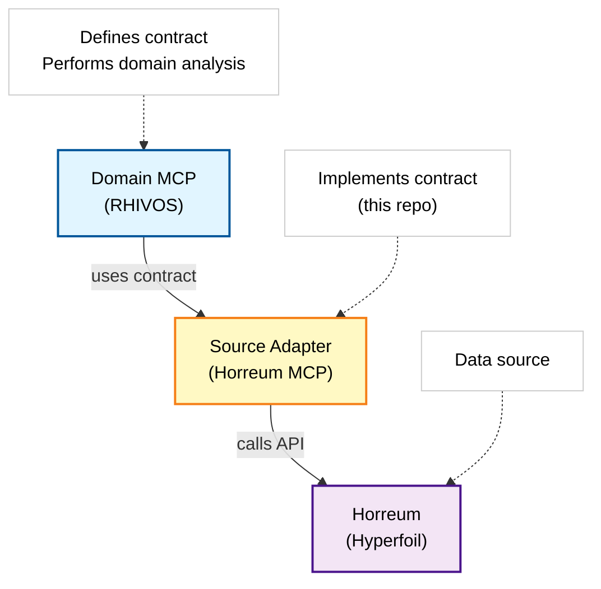
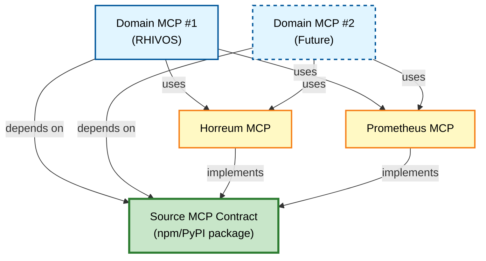

# Source MCP Contract Reference

This document summarizes the Source MCP Contract that Horreum MCP implements.

## Contract Location

The canonical Source MCP Contract is defined in the Domain MCP repository:

```
/home/dblack/git/gitlab/perfscale/sandbox/rhivos-perfscale-mcp/docs/contracts/source-mcp-contract.md
```

## Architecture



## Why Contract is in Domain MCP

**Current Design:**

- Domain MCP defines what data it needs and how it should be structured
- Multiple source adapters (Horreum, Prometheus, etc.) implement same contract
- Ensures consistency across all data sources

**Future Consideration:**
If multiple Domain MCPs emerge, the contract should be extracted into a
separate repository/package that both domains and sources depend on.



## Key Contract Requirements

This section documents the key requirements Horreum MCP must satisfy.

### 1. Field Naming Convention

**Rule:** All fields use `snake_case` naming

```typescript
// ✅ Correct
{
  "run_id": "123",
  "dataset_id": "456",
  "test_id": "789",
  "has_more": false,
  "total_count": 42
}

// ❌ Incorrect
{
  "runId": 123,
  "datasetId": 456,
  "testId": 789,
  "hasMore": false,
  "totalCount": 42
}
```

### 2. ID Field Types

**Rule:** IDs are represented as strings, not numbers

```typescript
// ✅ Correct
{
  "run_id": "120214",      // string
  "dataset_id": "323991",  // string
  "test_id": "262"         // string
}

// ❌ Incorrect
{
  "run_id": 120214,        // number
  "dataset_id": 323991,    // number
  "test_id": 262           // number
}
```

**Input:** Endpoints must accept both string and numeric inputs for
compatibility.

### 3. Timestamp Format

**Rule:** Timestamps are ISO 8601 datetime strings with millisecond precision

```typescript
// ✅ Correct
{
  "start": "2025-10-08T01:20:26.747Z",
  "stop": "2025-10-08T01:41:47.248Z"
}

// ❌ Incorrect
{
  "start": 1759886426747,  // epoch milliseconds
  "stop": 1759887707248
}
```

### 4. Label Values Structure

**Rule:** Label values are arrays of `{name, value}` objects, not dictionaries

```typescript
// ✅ Correct
{
  "values": [
    {"name": "boot_time_ms", "value": 523},
    {"name": "kernel_version", "value": "6.1.0"}
  ]
}

// ❌ Incorrect
{
  "values": {
    "boot_time_ms": 523,
    "kernel_version": "6.1.0"
  }
}
```

### 5. Response Wrapper Structure

**Rule:** List responses must be wrapped in `{items, pagination}` structure

```typescript
// ✅ Correct
{
  "items": [
    {/* label value object */},
    {/* label value object */}
  ],
  "pagination": {
    "has_more": false,
    "total_count": 2
  }
}

// ❌ Incorrect - bare array
[
  {/* label value object */},
  {/* label value object */}
]
```

### 6. Error Response Format

**Rule:** Errors follow standardized structure

```typescript
{
  "error": {
    "code": "NOT_FOUND" | "INVALID_REQUEST" | "RATE_LIMITED" |
            "INTERNAL_ERROR" | "SERVICE_UNAVAILABLE" | "TIMEOUT",
    "message": "Human-readable error message",
    "details": {
      // Context-specific details
    },
    "retryable": boolean,
    "retryAfter"?: number  // seconds to wait before retry
  }
}
```

### 7. Pagination Structure

**Rule:** Pagination metadata uses snake_case with specific fields

```typescript
{
  "pagination": {
    "has_more": boolean,       // Are there more results?
    "total_count": number,     // Total items (if known)
    "next_page_token"?: string // Opaque token for next page
  }
}
```

## Implementation Status

### ✅ Fully Compliant Endpoints

All Horreum MCP endpoints implement the Source MCP Contract:

- **source.describe** - Capability discovery (✅ snake_case fields)
- Label Values endpoints (`get_run_label_values`, `get_test_label_values`,
  `get_dataset_label_values`)
- List endpoints (`list_runs`, `list_tests`, `list_datasets`)
- Get endpoints (`get_run`, `get_test`, `get_dataset`)
- Error responses across all endpoints

### Transformation Layer

Horreum MCP includes a transformation layer that converts Horreum's native
API responses to Source MCP Contract format:

- `transformLabelValues()` - Converts label values structure
- Field name conversion (camelCase → snake_case)
- ID type conversion (number → string)
- Timestamp conversion (epoch millis → ISO 8601)
- Response wrapping ({items, pagination})

## Testing Contract Compliance

Run the contract compliance smoke tests:

```bash
# Label values format compliance
node scripts/smoke-label-values-format.mjs [RUN_ID]

# Schema compliance (IDs, snake_case, etc.)
node scripts/smoke-schema-compliance.mjs
```

## Future: Separate Contract Repository

If multiple Domain MCPs emerge, consider extracting the contract to a
shared repository:

```
@perfscale/source-mcp-contract
├── typescript/
│   └── interfaces.ts    # TypeScript type definitions
├── python/
│   └── models.py        # Pydantic models
├── openapi/
│   └── spec.yaml        # OpenAPI specification
└── docs/
    └── contract.md      # Human-readable documentation
```

This would allow:

- Multiple domains to use the same contract
- Versioned contract evolution (semver)
- Language-specific bindings
- Clear contract ownership

## Related Documentation

- **[Label Values Filtering](../user-guide/filtering.md)** - Query and filter guide
- **[Development Plan](../../mcp_development_plan.md)** - Implementation status and history
- **[Troubleshooting](../troubleshooting/README.md)** - Known issues and workarounds

## Questions or Changes

If you have questions about the contract or need to propose changes:

1. **For clarifications**: Review the canonical contract in Domain MCP
2. **For changes**: Propose changes to the Domain MCP team
3. **For bugs**: Check if it's a contract issue or implementation issue

The Domain MCP team owns the contract specification. Source adapters
(like Horreum MCP) are responsible for correct implementation.
