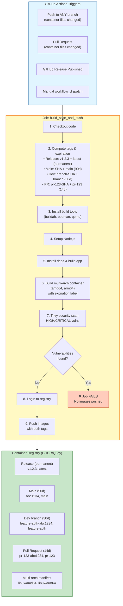
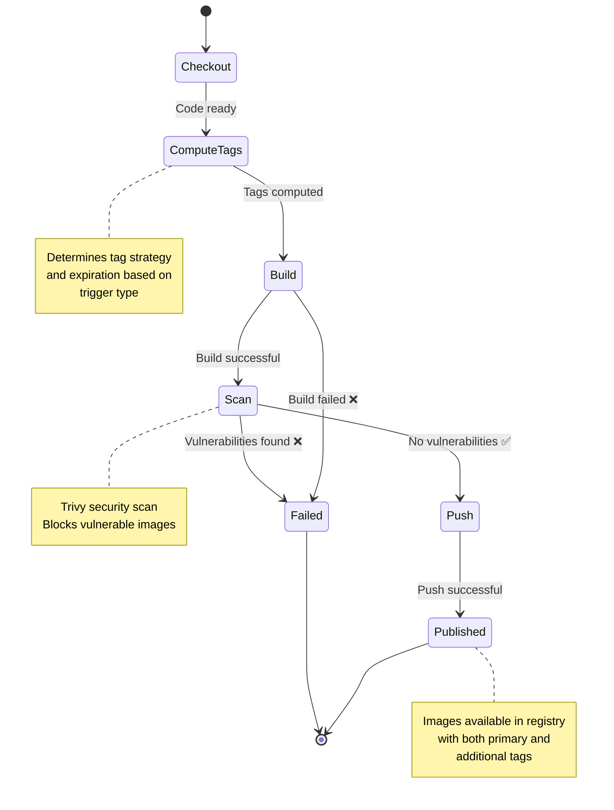

# Container Build Workflow Architecture

## Overview

This document provides a visual representation of the container build,
security scanning, and deployment workflow. The workflow supports builds for
all branches, pull requests, and releases with intelligent tagging and
automatic image expiration.

## Workflow Diagram



## Workflow States



## Image Tagging Strategy

| Build Type       | Primary Tag      | Additional Tag | Expiration | Example                    |
| ---------------- | ---------------- | -------------- | ---------- | -------------------------- |
| **Release**      | `v{VERSION}`     | `latest`       | Never      | `v0.1.0`, `latest`         |
| **Main Branch**  | `{SHORT_SHA}`    | `main`         | 90 days    | `abc1234`, `main`          |
| **Dev Branch**   | `{BRANCH}-{SHA}` | `{BRANCH}`     | 30 days    | `feature-auth-abc1234`     |
| **Pull Request** | `pr-{NUM}-{SHA}` | `pr-{NUM}`     | 14 days    | `pr-123-abc1234`, `pr-123` |

**Note**: Branch names with slashes (e.g., `feature/auth`) are sanitized to
`feature-auth` for container tag compatibility.

## Automatic Image Expiration

Images are automatically expired based on their purpose:

- **Releases**: Never expire (permanent artifacts)
- **Main branch**: 90 days (long-term development history)
- **Dev branches**: 30 days (active development)
- **Pull requests**: 14 days (short-lived validation)

This ensures registry cleanliness while preserving important artifacts.

## Key Benefits

1. **Security Gate**: Vulnerable images blocked before reaching registry
2. **Universal Coverage**: All branches and PRs get automated builds
3. **Easy Testing**: Predictable tags for pulling any branch/PR image
4. **Automatic Cleanup**: Short-lived images expire automatically
5. **Efficiency**: Single build pass, no duplication
6. **Simplicity**: One job does build → scan → push in sequence
7. **Permanent Releases**: Release images never expire

## Concurrency

Only one build runs per branch at a time. New pushes cancel in-progress builds
to prevent race conditions.

## Configuration

- **Repository Variable**: `IMAGE_REPO` (e.g., `ghcr.io/org/horreum-mcp`)
- **Secrets**: `QUAY_USERNAME`, `QUAY_PASSWORD` (if using Quay.io)

## Usage Examples

```bash
# Pull release version (permanent)
podman pull ghcr.io/dustinblack/horreum-mcp:v0.1.0
podman pull ghcr.io/dustinblack/horreum-mcp:latest

# Pull main branch (latest commit on main)
podman pull ghcr.io/dustinblack/horreum-mcp:main

# Pull development branch (test before merging)
podman pull ghcr.io/dustinblack/horreum-mcp:feature-auth

# Pull specific commit from dev branch
podman pull ghcr.io/dustinblack/horreum-mcp:feature-auth-abc1234

# Pull PR image (test PR changes)
podman pull ghcr.io/dustinblack/horreum-mcp:pr-123

# Pull specific commit from PR
podman pull ghcr.io/dustinblack/horreum-mcp:pr-123-abc1234
```

## Evolution

| Aspect              | Phase 5 (Initial)      | Phase 7 (Enhanced)                    |
| ------------------- | ---------------------- | ------------------------------------- |
| **Branch Support**  | Main only              | All branches + PRs                    |
| **Tagging**         | SHA + main             | Release/Main/Branch/PR with dual tags |
| **Expiration**      | 90d for all            | Tiered (never/90d/30d/14d)            |
| **Release Support** | Yes                    | Yes (permanent images)                |
| **Job Count**       | 1 (build+scan+push)    | 1 (build+scan+push)                   |
| **Scan Timing**     | Before push            | Before push                           |
| **Multi-arch**      | Yes (amd64, arm64)     | Yes (amd64, arm64)                    |
| **Use Case**        | Production deployments | Production + development + PR testing |

## References

- [Trivy Documentation](https://aquasecurity.github.io/trivy/)
- [GitHub Actions Workflow Syntax](https://docs.github.com/en/actions/using-workflows/workflow-syntax-for-github-actions)
